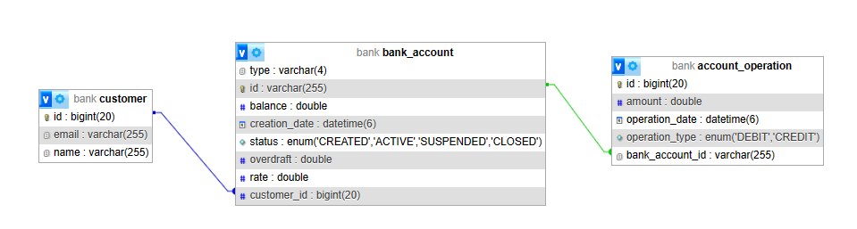
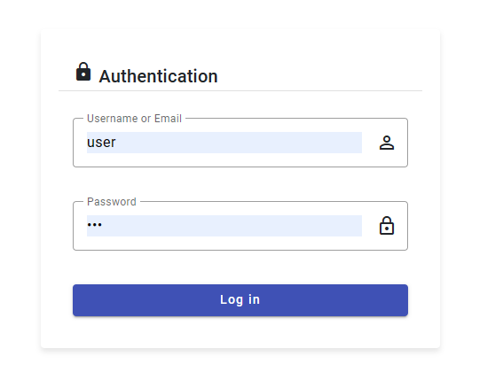
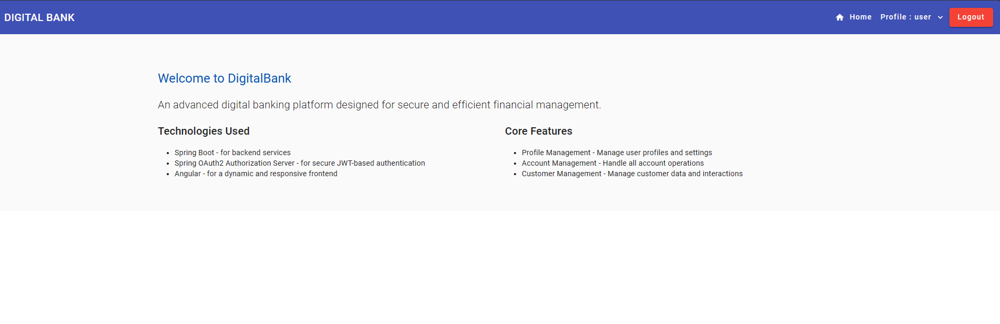
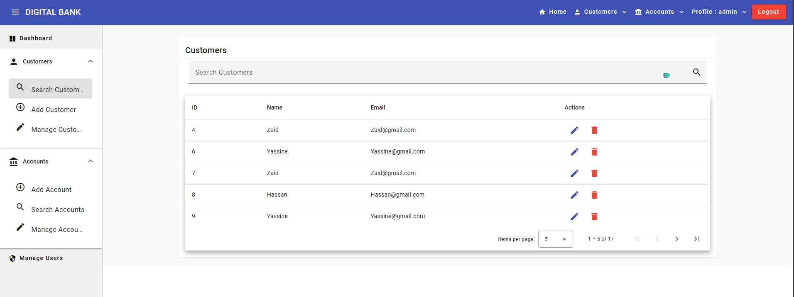
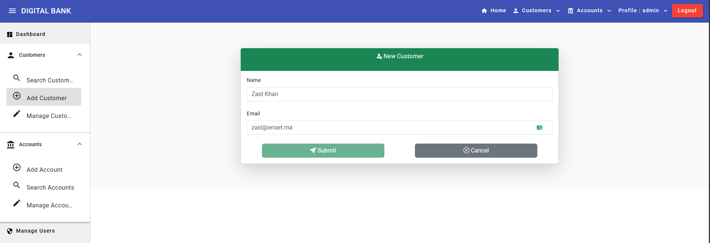
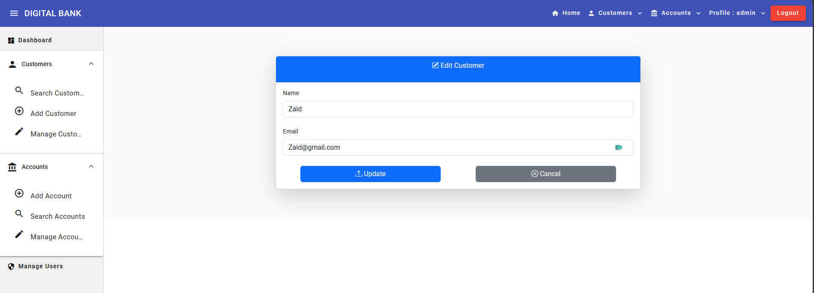
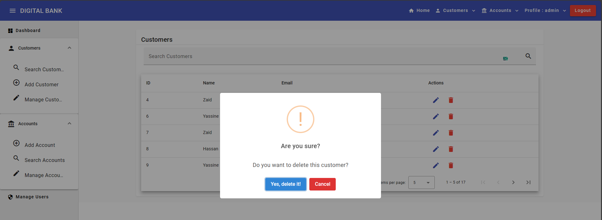
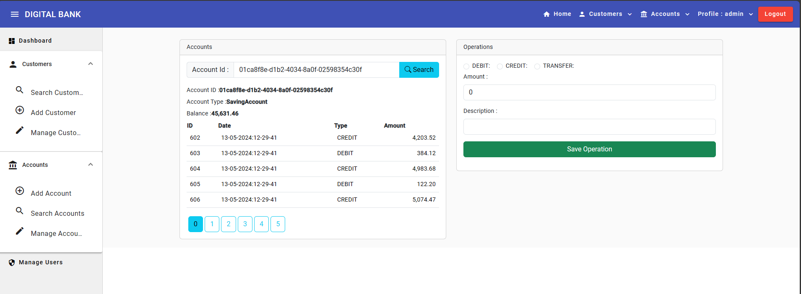
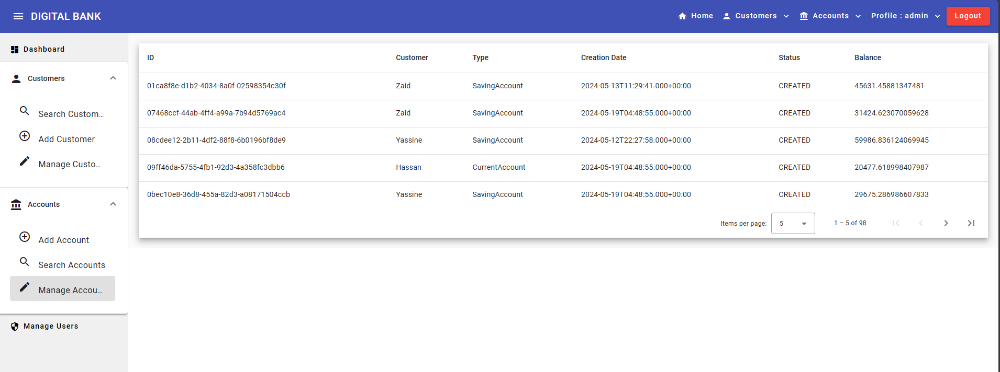
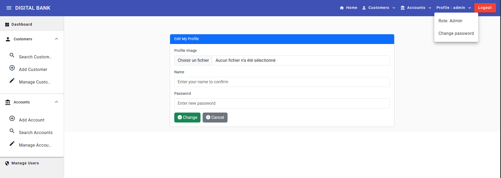

# Digital Banking Application

An advanced banking account management application designed for handling customers, bank accounts, and various transactions including debits and credits.

## Contents

1. [Project Overview](#project-overview)
2. [Technologies Utilized](#technologies-utilized)
3. [Key Features](#key-features)
4. [Project Architecture](#project-architecture)
5. [Setup and Configuration](#setup-and-configuration)
6. [Screenshots](#screenshots)

## Project Overview

Digital Banking is a sophisticated application built for managing banking accounts. Each account links to a customer and supports multiple transactions, either debits or credits. The system accommodates two types of accounts: Current Accounts and Savings Accounts.

The project is structured into two main components: a Spring Boot backend and an Angular frontend.

### Backend

1. **Data Access Layer (DAO):**
    - Creation of JPA entities: Customer, BankAccount, SavingAccount, CurrentAccount, AccountOperation.
    - Definition of JPA Repository interfaces based on Spring Data.
    - DAO layer testing.

2. **Service and Web Layer:**
    - Development of service layer, DTOs, and Mappers.
    - Creation of RestControllers for RESTful web services.
    - Testing of RESTful web services.

3. **API Documentation:**
    - Integration of Swagger for API documentation using the following dependency:
      ```xml
      <dependency>
        <groupId>org.springdoc</groupId>
        <artifactId>springdoc-openapi-starter-webmvc-ui</artifactId>
        <version>2.1.0</version>
      </dependency>
      ```

4. **Security:**
    - Implementation of authentication system using Spring Security and JSON Web Token (JWT).

### Frontend

1. **Client and Account Management:**
    - Development of interfaces for managing clients and bank accounts.

2. **Dashboard and Analytics:**
    - Utilization of ChartJS (ng-chart) for creating dashboards and statistical graphics.

## Technologies Utilized

- **Backend:**
    - Spring Boot
    - Spring Data JPA
    - Spring Security
    - Springdoc OpenAPI (Swagger)
    - H2 Database (for testing)
    - MySQL
    - JSON Web Token (JWT)

- **Frontend:**
    - Angular
    - Bootstrap
    - ChartJS (ng-chart)

## Key Features

- Customer management: Add, delete, edit, and search customers.
- Account management: Add, search, and manage accounts.
- Transaction logging with authenticated user identifiers.
- User account and password management.
- Dashboard with charts and statistics.

## Project Architecture



## Setup and Configuration

1. Clone the repository:
   ```bash
   git clone https://github.com/ELMOUADDIBE/DigitalBanking_Spring_Angular.git
   ```

2. Configure the database in `application.properties`:
   ```properties
    spring.application.name=DigitalBanking_Spring_Angular
    server.port=8080
    
    #H2 Database Configuration
    #spring.datasource.url=jdbc:h2:mem:bank
    #spring.h2.console.enabled=true
    
    #MySQL Database Configuration
    spring.datasource.url=jdbc:mysql://localhost:3306/bank?createDatabaseIfNotExist=true
    spring.datasource.username=root
    spring.datasource.password=
    spring.jpa.hibernate.ddl-auto=update
    spring.jpa.properties.hibernate.dialect=org.hibernate.dialect.MariaDBDialect
    spring.jpa.show-sql=true
   ```

3. Start the Spring Boot application:
   ```bash
   mvn spring-boot:run
   ```

4. Navigate to the frontend Angular directory and start the development server:
   ```bash
   cd frontend
   npm install
   ng serve
   ```

5. Access the application at `http://localhost:4200`.

## Screenshots

### Login Page


### User Home Page


### Dashboard


### Customer List


### Add Customer


### Edit Customer


### Delete Customer


### Account Search


### Account List


### Edit Profile

